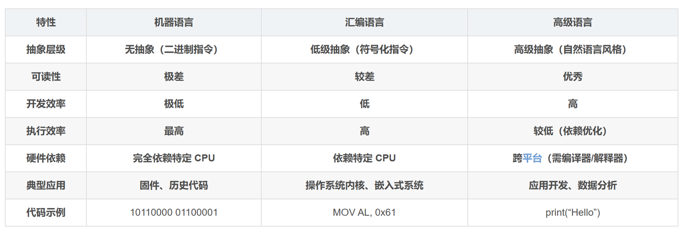
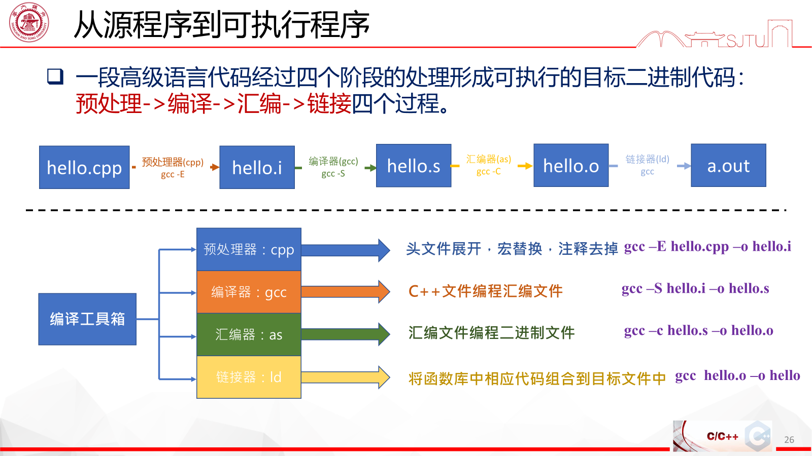

# 绪论

> 本章介绍计算机信息表示、程序设计语言层次、编译运行流程和程序设计过程。以下正文保留原始课堂笔记的全部要点。

### 基本

内存的最小单元是bit，一个bit存储一个二进制位（0/1）。一般8个bit组成一个byte

在一般的机器中，内存按字节（byte）编址，内存大小也是按字节计量

基本单位 位 比特 bit b

字节 byte B

位：计算机中的**最小**的存储和处理单位，所有数据的处理和存储都是以bit为基础，例如算数运算、逻辑运算等。一个bit只能表示0和1

字节：计算机数据存储和处理的**基本**单位，通常为8位，是一种度量方式，类似于分钟、平方米（内存地址是对字节进行编号）

字长：计算机处理器一次运算中能够处理的**最大数据宽度**，由硬件设备决定，如32位处理器（单次可传输32位信息）——数据总线的宽度

进制

十进制

二进制

十六进制

按字节寻址情况下可寻址范围是？(即地址编号的数量）   FFFF+1= 2^16^     FFFF FFFF + 1 = 2^32^

F=1111

存储FFFF至少需要2个Byte，实际情况是4B

### 高级语言和低级语言的区别

### 程序（从源程序到可执行程序）

### 程序设计过程

算法设计   编码   编译与链接   调试与维护

